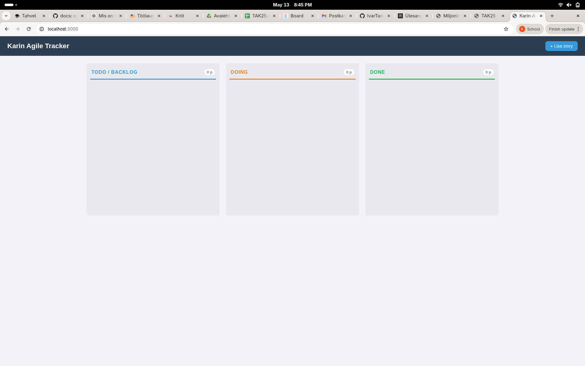

# Karin Agile Tracker

Veebirakendus agiilse tarkvaraprojekti kasutajalugude (story'de) haldamiseks Kanban-laual.


> *Lisa siia ekraanipilt töötavast Kanban-lauast (failinimi: screenshot.png)*

---

## 1. Tehnoloogiad

| Kiht | Tehnoloogia |
|------|-------------|
| Backend | Node.js + Express |
| Andmebaas | SQLite (better-sqlite3) |
| Frontend | HTML5, CSS3, Vanilla JavaScript |
| Drag-and-drop | SortableJS (CDN) |

---

## 2. Käivitamine

**Eeldused:** Node.js (v18+) peab olema paigaldatud.

```bash
# 1. Kloni repo
git clone https://github.com/KarinHakm/karin-agile-tracker.git
cd karin-agile-tracker

# 2. Paigalda sõltuvused
npm install

# 3. Käivita server
npm start
```

Rakendus avaneb aadressil **http://localhost:3000**

Arendusrežiimis (automaatne taaskäivitus):

```bash
npm run dev
```

> Andmebaas (`stories.db`) luuakse automaatselt esimesel käivitusel koos 4 näidis-story'ga.

---

## 3. Valmis funktsioonid

- [x] Kanban-laud kolme veeruga: Todo/Backlog, Doing, Done
- [x] Story lisamine (pealkiri, kirjeldus, punktid, staatus, vastuvõtutingimused)
- [x] Story muutmine
- [x] Story kustutamine
- [x] Story staatuse muutmine (drag-and-drop veergude vahel)
- [x] Backlog story'de lohistamine prioriteedi muutmiseks
- [x] Backlog järjekorra säilimine pärast lehe uuendamist
- [x] Punktide määramine (validatsioon: täisarv, mitte-negatiivne, kohustuslik)
- [x] Vastuvõtutingimuste lisamine story'le
- [x] Kommentaaride lisamine koos lisamise ajaga
- [x] Kommentaaride kustutamine
- [x] Story detailvaade (staatus, punktid, loomise/muutmise aeg, tingimused, kommentaarid)
- [x] Punktide summa iga veeru all
- [x] REST API kõigi vajalike endpoint'idega
- [x] 4 näidis-story'd testimiseks (lisatakse automaatselt tühja andmebaasi)
- [x] Veateated vale sisendi korral (toast-teated)

---

## 4. Pooleli jäänud funktsioonid

- [ ] Otsing story pealkirja järgi
- [ ] Filtreerimine punktide järgi
- [ ] Automaattestid REST API jaoks

---

## 5. Keerulisemad kohad

**Drag-and-drop koos API-ga** — SortableJS lohistamine tuli ühendada kahe erineva API-kutsega: staatuse muutmine veergude vahel (`PATCH /status`) ja järjekorra salvestamine backlogis (`PATCH /reorder`). Keeruline oli tagada, et järjekord säiliks ka pärast lehe uuendamist.

**Route'ide järjekord Expressis** — `PATCH /api/stories/reorder` pidi olema defineeritud enne `PATCH /api/stories/:id/status`, muidu tõlgendas Express `reorder` kui `:id` parameetrit.

**Punktide valideerimine** — tuli tagada, et nii frontend kui backend kontrollivad, et punktid on mitte-negatiivne täisarv ja ei ole tühi.

---

## 6. REST API endpoint'id

| Meetod | URL | Kirjeldus |
|--------|-----|-----------|
| `GET` | `/api/stories` | Kõik story'd koos kriteeriumite ja kommentaaridega |
| `GET` | `/api/stories/:id` | Ühe story detailid |
| `POST` | `/api/stories` | Loo uus story |
| `PUT` | `/api/stories/:id` | Uuenda story andmed |
| `DELETE` | `/api/stories/:id` | Kustuta story |
| `PATCH` | `/api/stories/reorder` | Uuenda backlog järjekord |
| `PATCH` | `/api/stories/:id/status` | Muuda story staatus |
| `POST` | `/api/stories/:id/comments` | Lisa kommentaar story'le |
| `DELETE` | `/api/stories/:id/comments/:commentId` | Kustuta kommentaar |

### Näidis andmestruktuur

```json
{
  "id": 1,
  "title": "Lisa story loomine",
  "description": "Kasutaja saab luua uue story.",
  "status": "todo",
  "points": 5,
  "priority": 1,
  "created_at": "2026-05-13 10:00",
  "updated_at": "2026-05-13 10:00",
  "acceptanceCriteria": [
    "Kasutaja saab sisestada pealkirja.",
    "Kasutaja saab sisestada punktid.",
    "Story ilmub backlogi."
  ],
  "comments": [
    {
      "id": 1,
      "text": "Seda tuleb testida.",
      "created_at": "2026-05-13 14:32"
    }
  ]
}
```

---

## Projekti struktuur

```
karin-agile-tracker/
├── server.js           # Express server
├── database.js         # SQLite seadistus ja seed andmed
├── routes/
│   └── stories.js      # REST API route'id
├── public/
│   ├── index.html      # Kanban laud
│   ├── style.css       # Kujundus
│   └── app.js          # Frontend loogika
└── README.md
```

---

## Arendustöövoog

Projekt arendati branch-põhise töövoo alusel: iga funktsioon eraldi branchil, muutused lisati main-i Pull Request'i kaudu.

Branchid, issue'd ja PR-ide ajalugu: https://github.com/vikk-tak25/karin-agile-tracker
